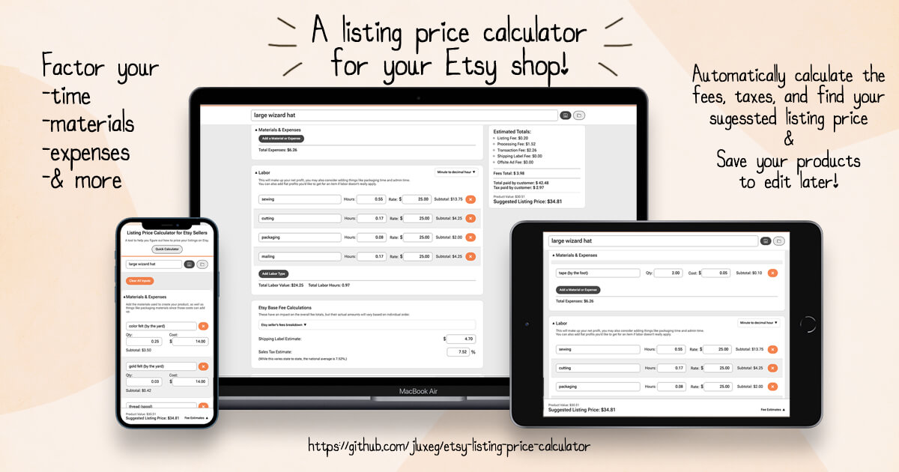

# etsy-listing-price-calculator
 a simple to use tool for etsy sellers to help determine what you should price your listings on based on materials, expenses, and labor to figure out the seller's fees.

todo: now i just got to write this up

---

## Contributing
Found a bug or have an idea to make the tool better?  
If you’d like to suggest an improvement or fix a bug, please check out the [CONTRIBUTING.md](./CONTRIBUTING.md) file for details.

## License
This project is licensed under a [Business Source License (BSL 1.1)](./LICENSE).  
You’re free to use this project to calculate and explore results, but the source code itself may not be copied, redistributed, or used commercially without permission.
